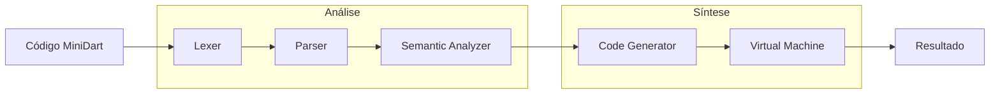

# 🚀 **MiniDart Compiler**

Um compilador completo para a linguagem **MiniDart** - uma linguagem de programação educacional com sintaxe em português, implementado em Dart.


---

## 📋 **Índice**

- [Visão Geral](#-visão-geral)
- [Características](#-características)
- [Arquitetura](#️-arquitetura)
- [Instalação](#-instalação)
- [Uso Rápido](#-uso-rápido)
- [Sintaxe MiniDart](#-sintaxe-minidart)
- [Exemplos](#-exemplos)
- [Documentação](#-documentação)
- [Estrutura do Projeto](#️-estrutura-do-projeto)
- [Desenvolvimento](#-desenvolvimento)
- [Contribuição](#-contribuição)

---

## 🎯 **Visão Geral**

O **MiniDart Compiler** é um projeto educacional que implementa um compilador completo para uma linguagem de programação própria. O projeto demonstra todos os estágios de compilação: análise léxica, sintática, semântica, geração de código e execução.

### **🌟 Principais Características**

- 🇧🇷 **Sintaxe em Português**: Keywords como `se`, `senao`, `enquanto`, `imprimir`
- 🏗️ **Arquitetura Modular**: Lexer → Parser → Semantic Analyzer → Code Generator → VM
- 🎯 **Padrão Visitor**: Design patterns modernos para processamento da AST
- ⚡ **Máquina Virtual**: Execução via bytecode em VM stack-based
- 🔍 **Análise Completa**: Verificação de escopo, tipos e erros semânticos
- 📝 **Documentação Rica**: Código completamente documentado em português

---

## ✨ **Características**

### **🔧 Funcionalidades Implementadas**

- ✅ **Variáveis**: Declaração e atribuição (`var nome = "João";`)
- ✅ **Tipos de Dados**: Números, strings, booleanos, nulo
- ✅ **Operadores Aritméticos**: `+`, `-`, `*`, `/`
- ✅ **Operadores Comparação**: `>`, `>=`, `<`, `<=`, `==`, `!=`
- ✅ **Operadores Lógicos**: `e` (AND), `ou` (OR), `!` (NOT)
- ✅ **Estruturas Condicionais**: `se`/`senao`
- ✅ **Loops**: `enquanto` (while)
- ✅ **Blocos de Código**: `{ ... }`
- ✅ **Impressão**: `imprimir valor;`
- ✅ **Expressões Complexas**: Precedência e parênteses

### **🚧 Futuras Implementações**

- 🔲 **Funções**: Definição e chamada
- 🔲 **Arrays**: Estruturas de dados
- 🔲 **Classes**: Programação orientada a objetos
- 🔲 **Loop For**: Iteração controlada
- 🔲 **Importações**: Sistema de módulos

---

## 🏗️ **Arquitetura**

O compilador implementa uma **pipeline de 5 estágios**:



### **📦 Componentes Principais**

| Componente | Responsabilidade | Arquivo |
|------------|------------------|---------|
| **Lexer** | Análise léxica (tokens) | `lib/src/lexer.dart` |
| **Parser** | Análise sintática (AST) | `lib/src/parser.dart` |
| **Semantic Analyzer** | Análise semântica | `lib/src/semantic_analyzer.dart` |
| **Code Generator** | Geração de bytecode | `lib/src/code_generator.dart` |
| **Virtual Machine** | Execução | `lib/src/vm.dart` |
| **AST** | Árvore sintática | `lib/src/ast.dart` |
| **Error Reporter** | Sistema de erros | `lib/src/error.dart` |

---

## 🚀 **Instalação**

### **Pré-requisitos**

- [Dart SDK](https://dart.dev/get-dart) 3.8.1 ou superior

### **Clone e Setup**

```bash
# Clone o repositório
git clone <repository-url>
cd minidart_compiler

# Instale as dependências
dart pub get

# Compile o projeto
dart compile exe bin/compile.dart -o minidart
```

---

## ⚡ **Uso Rápido**

### **1. Crie um arquivo MiniDart**

```dart
// exemplo.mdart
var nome = "Mundo";
var numero = 42;

se (numero > 10) {
    imprimir "Número grande: ";
    imprimir numero;
} senao {
    imprimir "Número pequeno";
}

imprimir "Olá, ";
imprimir nome;
```

### **2. Execute o compilador**

```bash
# Executar diretamente
dart run bin/compile.dart exemplos/exemplo.mdart

# Ou usar o executável compilado
./minidart exemplos/exemplo.mdart
```

### **3. Saída esperada**

```
Número grande: 
42
Olá, 
Mundo
```

---

## 📝 **Sintaxe MiniDart**

### **🔤 Palavras-chave**

| Português | Função |
|-----------|---------|
| `var` | Declaração de variável |
| `se` | Condicional if |
| `senao` | Condicional else |
| `enquanto` | Loop while |
| `imprimir` | Comando print |
| `verdadeiro` | Boolean true |
| `falso` | Boolean false |
| `nulo` | Valor null |
| `e` | Operador AND |
| `ou` | Operador OR |

### **🎯 Tipos de Dados**

```dart
// Números (int/double)
var inteiro = 42;
var decimal = 3.14;

// Strings
var texto = "Olá, MiniDart!";

// Booleanos
var ativo = verdadeiro;
var inativo = falso;

// Nulo
var vazio = nulo;
```

### **⚙️ Operadores**

```dart
// Aritméticos
var soma = 10 + 5;        // 15
var mult = 3 * 4;         // 12

// Comparação
var maior = 10 > 5;       // verdadeiro
var igual = x == y;       // booleano

// Lógicos
var ambos = verdadeiro e falso;    // falso
var algum = verdadeiro ou falso;   // verdadeiro
var nao = !verdadeiro;             // falso
```

### **🔀 Estruturas de Controle**

```dart
// Condicional
se (idade >= 18) {
    imprimir "Adulto";
} senao {
    imprimir "Menor de idade";
}

// Loop
var contador = 0;
enquanto (contador < 5) {
    imprimir contador;
    contador = contador + 1;
}
```

---

## 🎪 **Exemplos**

### **📊 Calculadora Simples**

```dart
// calculadora.mdart
var a = 10;
var b = 3;

imprimir "Calculadora MiniDart";
imprimir "a = ";
imprimir a;
imprimir "b = ";
imprimir b;

imprimir "Soma: ";
imprimir a + b;

imprimir "Multiplicação: ";
imprimir a * b;

imprimir "a > b: ";
imprimir a > b;
```

### **🔢 Contador com Loop**

```dart
// contador.mdart
var i = 1;
var limite = 5;

imprimir "Contando até ";
imprimir limite;

enquanto (i <= limite) {
    imprimir "Número: ";
    imprimir i;
    i = i + 1;
}

imprimir "Fim da contagem!";
```

### **🎯 Validação de Nota**

```dart
// notas.mdart
var nota = 8.5;
var aprovacao = 7.0;

se (nota >= aprovacao) {
    imprimir "Aprovado!";
    imprimir "Nota: ";
    imprimir nota;
} senao {
    imprimir "Reprovado";
    imprimir "Nota insuficiente: ";
    imprimir nota;
}
```

---

## 📚 **Documentação**

### **📖 Documentos Detalhados**

- **[parser.md](parser.md)** - Análise completa do parser de descida recursiva
- **AST Documentation** - Padrão Visitor e estrutura da árvore sintática
- **Lexer Guide** - Análise léxica e tokenização
- **VM Architecture** - Máquina virtual stack-based

### **🔍 Análise do Código**

Todos os arquivos possuem documentação completa em português:

```dart
/// **Análise Léxica do MiniDart**
/// 
/// Converte código fonte em uma sequência de tokens, reconhecendo:
/// - Palavras-chave em português (se, enquanto, imprimir)
/// - Operadores (+, -, *, /, ==, !=, etc.)
/// - Literais (números, strings, booleanos)
/// - Identificadores de variáveis
/// - Delimitadores e pontuação
class Lexer {
  // Implementação completamente documentada...
}
```

---

## 🗂️ **Estrutura do Projeto**

```
minidart_compiler/
├── 📁 bin/
│   └── compile.dart              # Ponto de entrada principal
├── 📁 lib/src/
│   ├── ast.dart                  # Árvore Sintática Abstrata
│   ├── bytecode.dart             # Definições de bytecode
│   ├── code_generator.dart       # Gerador de código
│   ├── error.dart                # Sistema de relatório de erros
│   ├── lexer.dart                # Analisador léxico
│   ├── parser.dart               # Analisador sintático
│   ├── semantic_analyzer.dart    # Analisador semântico
│   ├── symbol_table.dart         # Tabela de símbolos
│   ├── token.dart                # Definições de tokens
│   └── vm.dart                   # Máquina virtual
├── 📁 exemplos/
│   ├── exemplo_basico.mdart      # Exemplo básico
│   ├── exemplo_completo.mdart    # Funcionalidades completas
│   ├── calculadora_notas.mdart   # Calculadora de notas
│   └── teste.mdart               # Casos de teste
├── 📁 test/
│   └── minidart_compiler_test.dart
├── 📄 README.md                  # Este arquivo
├── 📄 parser.md                  # Documentação do parser
├── 📄 pubspec.yaml               # Configuração do projeto
└── 📄 analysis_options.yaml      # Opções de análise
```

---

## 🛠️ **Desenvolvimento**

### **🧪 Testes**

```bash
# Executar todos os testes
dart test

# Executar testes específicos
dart test test/minidart_compiler_test.dart
```

### **🔧 Lint e Análise**

```bash
# Análise de código
dart analyze

# Formatação
dart format .
```

### **📊 Debugging**

O compilador oferece saída detalhada para debugging:

```bash
# Modo verbose (se implementado)
dart run bin/compile.dart --verbose exemplos/teste.mdart

# Análise de tokens
dart run bin/compile.dart --tokens exemplos/teste.mdart

# Dump da AST
dart run bin/compile.dart --ast exemplos/teste.mdart
```

---

## 🤝 **Contribuição**

### **🎯 Como Contribuir**

1. **Fork** o projeto
2. Crie uma **branch** para sua feature (`git checkout -b feature/AmazingFeature`)
3. **Commit** suas mudanças (`git commit -m 'Add some AmazingFeature'`)
4. **Push** para a branch (`git push origin feature/AmazingFeature`)
5. Abra um **Pull Request**

### **📋 Áreas para Contribuição**

- 🔧 **Novas funcionalidades** (funções, classes, arrays)
- 🐛 **Correção de bugs**
- 📚 **Documentação** e exemplos
- ⚡ **Otimizações** de performance
- 🧪 **Testes** unitários e integração
- 🎨 **Melhorias** na interface CLI

### **📝 Padrões de Código**

- Documentação completa em português
- Seguir convenções Dart
- Testes para novas funcionalidades
- Exemplos práticos para features

---

## 📄 **Licença**

Este projeto está sob a licença MIT. Veja o arquivo [LICENSE](LICENSE) para detalhes.

---

## 👨‍💻 **Autor**

**Deriks Karlay Dias Costa**

Projeto desenvolvido como demonstração educacional de um compilador completo em Dart.

---

## 🙏 **Agradecimentos**

- Comunidade Dart pelos recursos e documentação
- Projetos de referência em compiladores educacionais
- Contribuidores e testadores

---

## 🔗 **Links Úteis**

- [Dart Language](https://dart.dev/)
- [Documentação do Projeto](parser.md)
- [Exemplos MiniDart](exemplos/)

---

**⭐ Se este projeto foi útil, considere dar uma estrela!**
