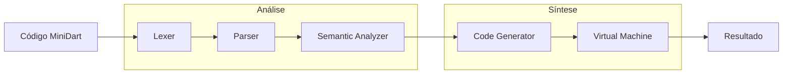

# 🚀 **MiniDart Compiler v1.5.0**

Um compilador completo para a linguagem **MiniDart** - uma linguagem de programação educacional com sintaxe em português, implementado em Dart.


---

## 📋 **Índice**

- [Visão Geral](#-visão-geral)
- [Características](#-características)
- [Arquitetura](#️-arquitetura)
- [Instalação](#-instalação)
- [Uso Rápido](#-uso-rápido)
- [Extensão VS Code](#️-extensão-vs-code)
- [Sintaxe MiniDart](#-sintaxe-minidart)
- [Exemplos](#-exemplos)
- [Documentação](#-documentação)
- [Estrutura do Projeto](#️-estrutura-do-projeto)
- [Desenvolvimento](#-desenvolvimento)
- [Contribuição](#-contribuição)

---

## 🎯 **Visão Geral**

O **MiniDart Compiler** é um projeto educacional que implementa um compilador completo para uma linguagem de programação própria. O projeto demonstra todos os estágios de compilação: análise léxica, sintática, semântica, geração de código e execução.

### **🌟 Principais Características**

- 🇧🇷 **Sintaxe em Português**: Keywords como `se`, `senao`, `enquanto`, `para`, `funcao`, `retornar`, `imprimir`
- � **Declarações Tipadas**: Suporte completo a tipos explícitos (`inteiro`, `real`, `texto`, `logico`, `vazio`)
- �🏗️ **Arquitetura Modular**: Lexer → Parser → Semantic Analyzer → Code Generator → VM
- 🎯 **Padrão Visitor**: Design patterns modernos para processamento da AST
- ⚡ **Máquina Virtual**: Execução via bytecode em VM stack-based com call stack completo
- 🔍 **Análise Completa**: Verificação de escopo, tipos e erros semânticos
- 🎯 **Funções Avançadas**: Sistema robusto com condicionais, loops e chamadas aninhadas
- 🌳 **Visualização AST**: Geração automática de diagramas com Graphviz
- 🛠️ **Extensão VS Code**: Suporte completo com syntax highlighting e comandos integrados
- 🎯 **Erro Reporting Preciso**: Localização exata com linha e coluna `[linha X, coluna Y]`
- 🔧 **CLI Flexível**: Opções para AST, bytecode e execução com atalhos `-a`, `-b`, `-v`
- 📝 **Documentação Rica**: Código completamente documentado em português

---

## ✨ **Características**

### **🔧 Funcionalidades Implementadas**

- ✅ **Declarações Tipadas**: `inteiro a = 10;`, `real altura = 1.75;`, `texto nome = "João";`, `logico ativo = verdadeiro;`
- ✅ **Valores Padrão Automáticos**: Variáveis sem inicialização recebem valores baseados no tipo
- ✅ **Variáveis Tradicionais**: Declaração e atribuição (`var nome = "João";`)
- ✅ **Tipos de Dados**: Números, strings, booleanos, nulo
- ✅ **Operadores Aritméticos**: `+`, `-`, `*`, `/`
- ✅ **Operadores Comparação**: `>`, `>=`, `<`, `<=`, `==`, `!=`
- ✅ **Operadores Lógicos**: `e` (AND), `ou` (OR), `!` (NOT)
- ✅ **Estruturas Condicionais**: `se`/`senao` (incluindo dentro de funções)
- ✅ **Loops Avançados**: `enquanto` (while), `para` (for básico e com incremento personalizado)
- ✅ **Funções Robustas**: Declaração, chamada, parâmetros, retorno, condicionais e loops internos
- ✅ **Blocos de Código**: `{ ... }`
- ✅ **Impressão**: `imprimir valor;`
- ✅ **Expressões Complexas**: Precedência, parênteses e chamadas aninhadas
- ✅ **Visualização AST**: Geração automática com Graphviz (incluindo tipos)
- ✅ **Extensão VS Code**: Syntax highlighting e comandos integrados

### **🚧 Futuras Implementações**

- 🔲 **Recursão**: Funções recursivas
- 🔲 **Arrays**: Estruturas de dados
- 🔲 **Classes**: Programação orientada a objetos
- 🔲 **Closures**: Funções anônimas e captura de escopo
- 🔲 **Importações**: Sistema de módulos

---

## 🏗️ **Arquitetura**

O compilador implementa uma **pipeline de 5 estágios**:



### **📦 Componentes Principais**

| Componente | Responsabilidade | Arquivo |
|------------|------------------|---------|
| **Lexer** | Análise léxica (tokens) | `lib/src/lexer.dart` |
| **Parser** | Análise sintática (AST) | `lib/src/parser.dart` |
| **Semantic Analyzer** | Análise semântica | `lib/src/semantic_analyzer.dart` |
| **Code Generator** | Geração de bytecode e funções | `lib/src/code_generator.dart` |
| **Virtual Machine** | Execução com call stack | `lib/src/vm.dart` |
| **Bytecode** | Instruções e funções compiladas | `lib/src/bytecode.dart` |
| **AST** | Árvore sintática com funções | `lib/src/ast.dart` |
| **Symbol Table** | Gerenciamento de escopo | `lib/src/symbol_table.dart` |
| **Error Reporter** | Sistema de erros | `lib/src/error.dart` |
| **VS Code Extension** | IDE Support | `vscode-extension/` |

---

## 🚀 **Instalação**

### **Pré-requisitos**

- [Dart SDK](https://dart.dev/get-dart) 3.8.1 ou superior

### **Clone e Setup**

```bash
# Clone o repositório
git clone <repository-url>
cd minidart_compiler

# Instale as dependências
dart pub get

# Compile o projeto
dart compile exe bin/compile.dart -o minidart
```

---

## ⚡ **Uso Rápido**

### **1. Crie um arquivo MiniDart**

```dart
// exemplo.mdart
var nome = "Mundo";
var numero = 42;

se (numero > 10) {
    imprimir "Número grande: ";
    imprimir numero;
} senao {
    imprimir "Número pequeno";
}

imprimir "Olá, ";
imprimir nome;
```

### **2. Execute o compilador**

```bash
# Executar diretamente
dart run bin/compile.dart exemplos/exemplo.mdart

# Ou usar o executável compilado
./minidart exemplos/exemplo.mdart

# Opções avançadas com atalhos
dart run bin/compile.dart exemplos/exemplo.mdart --ast-only    # ou -a
dart run bin/compile.dart exemplos/exemplo.mdart --bytecode   # ou -b
dart run bin/compile.dart --version                           # ou -v

# Gerar apenas a AST em Graphviz (sem executar)
dart run bin/compile.dart exemplos/exemplo.mdart -a

# Mostrar bytecode gerado (para debugging)
dart run bin/compile.dart exemplos/exemplo.mdart -b

# Verificar versão do compilador
dart run bin/compile.dart -v
```

### **3. Saída esperada**

```
Número grande: 
42
Olá, 
Mundo
```

### **🎯 Erro Reporting Avançado**

O MiniDart Compiler v1.4.1 inclui sistema de erro reporting de alta precisão:

```bash
# Exemplo com erro intencional
echo 'imprimir "texto" + 123;' > erro_exemplo.mdart
dart run bin/compile.dart erro_exemplo.mdart
```

**Saída de erro com localização precisa:**
```
Erro de Execução: Operandos devem ser dois números ou duas strings.
[linha 1, coluna 18]
```

**Características do sistema de erros:**
- 🎯 **Localização exata**: Mostra linha e coluna do erro
- 🔍 **Mapeamento correto**: Linhas do código fonte (não bytecode)
- 🛠️ **Debugging facilitado**: Identificação imediata do problema
- ✅ **Compatibilidade**: Suporte a diferentes line endings (Windows/Unix)

### **4. 🌳 Visualizar a Árvore Sintática (AST)**

O compilador gera automaticamente a AST em formato Graphviz:

```bash
# Executar o compilador (gera minidart_ast.dot automaticamente)
dart run bin/compile.dart exemplos/exemplo_ast.mdart

# Gerar apenas AST (sem compilar/executar) - Nova opção v1.4.1
dart run bin/compile.dart exemplos/exemplo_ast.mdart --ast-only
# ou usar o atalho
dart run bin/compile.dart exemplos/exemplo_ast.mdart -a

# Converter para imagem (requer Graphviz instalado)
dot -Tpng minidart_ast.dot -o ast.png

# Outros formatos
dot -Tsvg minidart_ast.dot -o ast.svg
dot -Tpdf minidart_ast.dot -o ast.pdf
```

### **🔧 Debugging com Bytecode**

Visualize o bytecode gerado para análise técnica:

```bash
# Mostrar bytecode durante compilação
dart run bin/compile.dart exemplos/exemplo.mdart --bytecode
# ou usar o atalho
dart run bin/compile.dart exemplos/exemplo.mdart -b

# Exemplo de saída
--- Bytecode Gerado ---
0000   -1 pushConst        0000 (Olá)
0001    1 print
0002   -1 return_
-----------------------
```

**Instalar Graphviz:**
- **Windows**: `winget install graphviz` ou baixar de [graphviz.org](https://graphviz.org/download/)
- **Ubuntu/Debian**: `sudo apt install graphviz`
- **macOS**: `brew install graphviz`

---

## 🛠️ **Extensão VS Code**

### **🎨 Suporte Completo para MiniDart no VS Code**

O MiniDart inclui uma **extensão completa para Visual Studio Code** com recursos profissionais de desenvolvimento:

#### **✨ Funcionalidades da Extensão**

- 🎨 **Syntax Highlighting**: Cores específicas para palavras-chave em português
- 📝 **Snippets Inteligentes**: Templates para algoritmo, função, se, enquanto, etc.
- ⚡ **Comandos Integrados**:
  - `Ctrl+F5`: Executar arquivo MiniDart
  - `Ctrl+Shift+B`: Compilar arquivo com bytecode
  - `Ctrl+Shift+A`: Gerar AST em Graphviz
  - `Ctrl+Shift+G`: Compilar e mostrar debug info
- 🔧 **Configurações Personalizáveis**:
  - Caminho do compilador
  - Auto-compilação ao salvar
  - Geração automática de AST
- 📄 **Criação de Arquivos**: Templates automáticos para novos arquivos `.mdart`
- 🖥️ **Terminal Integrado**: Execução direta no terminal do VS Code

#### **📦 Instalação da Extensão**

```bash
# 1. Desenvolvimento local (para testar)
cd vscode-extension
npm install
npm run compile
# Pressione F5 no VS Code para testar

# 2. Instalação via VSIX (em breve)
npm install -g vsce
vsce package
code --install-extension minidart-1.2.0.vsix
```

#### **🚀 Como Usar no VS Code**

1. **Instale a extensão** (seguindo instruções acima)
2. **Abra um arquivo `.mdart`** ou crie um novo
3. **Use os comandos**:
   - Paleta de comandos (`Ctrl+Shift+P`) → "MiniDart"
   - Botões na barra de título do editor
   - Menu de contexto (clique direito)
   - Atalhos de teclado

#### **🎯 Configurações Disponíveis**

```json
{
  "minidart.compilerPath": "bin/compile.dart",
  "minidart.autoCompile": false,
  "minidart.showAST": false
}
```

---

## 📝 **Sintaxe MiniDart**

### **🔤 Palavras-chave**

| Português | Função |
|-----------|---------|
| `var` | Declaração de variável tradicional |
| `inteiro` | Tipo inteiro |
| `real` | Tipo ponto flutuante |
| `texto` | Tipo string |
| `logico` | Tipo booleano |
| `vazio` | Tipo void |
| `se` | Condicional if |
| `senao` | Condicional else |
| `enquanto` | Loop while |
| `para` | Loop for |
| `ate` | Até (limite for) |
| `passo` | Incremento personalizado |
| `faca` | Faça (corpo for) |
| `funcao` | Declaração de função |
| `retornar` | Retorno de função |
| `imprimir` | Comando print |
| `verdadeiro` | Boolean true |
| `falso` | Boolean false |
| `nulo` | Valor null |
| `e` | Operador AND |
| `ou` | Operador OR |

### **🎯 Tipos de Dados**

```dart
// ===== DECLARAÇÕES TIPADAS (v1.5.0) =====
inteiro idade = 25;           // Inteiro
real altura = 1.75;           // Ponto flutuante
texto nome = "Maria";         // String
logico ativo = verdadeiro;    // Booleano

// Valores padrão automáticos
inteiro contador;             // Inicializa com 0
real preco;                   // Inicializa com 0.0
texto descricao;              // Inicializa com ""
logico disponivel;            // Inicializa com falso

// ===== DECLARAÇÕES TRADICIONAIS =====
var numero = 42;              // Inferência de tipo
var texto = "Olá, MiniDart!"; // String
var ativo = verdadeiro;       // Boolean
var vazio = nulo;             // Null
```

### **⚙️ Operadores**

```dart
// Aritméticos
var soma = 10 + 5;        // 15
var mult = 3 * 4;         // 12

// Comparação
var maior = 10 > 5;       // verdadeiro
var igual = x == y;       // booleano

// Lógicos
var ambos = verdadeiro e falso;    // falso
var algum = verdadeiro ou falso;   // verdadeiro
var nao = !verdadeiro;             // falso
```

### **🔀 Estruturas de Controle**

```dart
// Condicional
se (idade >= 18) {
    imprimir "Adulto";
} senao {
    imprimir "Menor de idade";
}

// Loop while
var contador = 0;
enquanto (contador < 5) {
    imprimir contador;
    contador = contador + 1;
}

// Loop for
para i = 1 ate 10 faca {
    imprimir i;
}

// Loop for com incremento personalizado
para x = 0 ate 20 passo 2 faca {
    imprimir x;  // 0, 2, 4, 6, 8, 10, 12, 14, 16, 18, 20
}
```

### **🎯 Funções**

```dart
// Declaração de função
real area_retangulo(real largura, real altura) {
    retornar largura * altura;
}

// Função com um parâmetro
inteiro quadrado(inteiro x) {
    retornar x * x;
}

// Chamadas de função
var resultado = area_retangulo(8, 6);  // 48
var quad = quadrado(7);                // 49

// Chamadas aninhadas
var complexo = quadrado(area_retangulo(3, 4));  // 144

// Função em expressões
imprimir "Área: ";
imprimir area_retangulo(5, 3);
```

---

## 🎪 **Exemplos**

### **📊 Calculadora com Tipos**

```dart
// calculadora_tipada.mdart
inteiro a = 10;
inteiro b = 3;
real resultado;

imprimir "Calculadora MiniDart com Tipos";
imprimir "a = ";
imprimir a;
imprimir "b = ";
imprimir b;

resultado = a + b;
imprimir "Soma: ";
imprimir resultado;

resultado = a * b;
imprimir "Multiplicação: ";
imprimir resultado;

logico maior = a > b;
imprimir "a > b: ";
imprimir maior;
```

### **🔢 Sistema de Notas Tipado**

```dart
// sistema_notas.mdart
real nota1 = 8.5;
real nota2 = 7.2;
real media;
texto situacao;

media = (nota1 + nota2) / 2;

se (media >= 7.0) {
    situacao = "Aprovado";
} senao {
    situacao = "Reprovado";
}

imprimir "Nota 1: ";
imprimir nota1;
imprimir "Nota 2: ";
imprimir nota2;
imprimir "Média: ";
imprimir media;
imprimir "Situação: ";
imprimir situacao;
```

### **🎯 Funções com Lógica Avançada**

```dart
// funcoes_avancadas.mdart
// Função com condicional interna
texto classificar_idade(inteiro anos) {
    se (anos < 18) {
        retornar "Menor de idade";
    } senao {
        retornar "Maior de idade";
    }
}

// Função com loop interno
inteiro fatorial(inteiro n) {
    var resultado = 1;
    var i = 1;
    enquanto (i <= n) {
        resultado = resultado * i;
        i = i + 1;
    }
    retornar resultado;
}

// Testando as funções
inteiro idade = 25;
texto classificacao = classificar_idade(idade);
inteiro fat5 = fatorial(5);

imprimir "Idade: ";
imprimir idade;
imprimir "Classificação: ";
imprimir classificacao;
imprimir "Fatorial de 5: ";
imprimir fat5;
```

### **🌟 Exemplo Completo de Todas as Funcionalidades**

Execute o arquivo que demonstra **todas as 13 categorias** de funcionalidades do MiniDart:

```bash
dart run bin/compile.dart exemplos/exemplo_completo_v1.5.0.mdart
```

Este exemplo inclui:
- ✅ **Declarações tipadas** e tradicionais
- ✅ **Operações** aritméticas e lógicas  
- ✅ **Funções** com condicionais e loops internos
- ✅ **Estruturas de controle** completas
- ✅ **Loops** básicos e com incremento
- ✅ **Blocos e escopo**
- ✅ **Expressões complexas** e chamadas aninhadas
- ✅ **Operadores** relacionais e lógicos
- ✅ **Reassignação** de variáveis
- ✅ **Demonstração integrativa** final
} senao {
    imprimir "Reprovado";
    imprimir "Nota insuficiente: ";
    imprimir nota;
}
```

### **🎯 Calculadora com Funções**

```dart
// calculadora_funcoes.mdart
funcao somar(a, b) {
    retornar a + b;
}

funcao multiplicar(x, y) {
    retornar x * y;
}

funcao quadrado(num) {
    retornar multiplicar(num, num);
}

// Usando as funções
var resultado1 = somar(10, 20);        // 30
var resultado2 = quadrado(5);          // 25
var resultado3 = somar(quadrado(3), multiplicar(2, 4));  // 17

imprimir "Soma: ";
imprimir resultado1;
imprimir "Quadrado: ";
imprimir resultado2;
imprimir "Expressão complexa: ";
imprimir resultado3;
```

### **🌳 Visualização da AST**

```dart
// exemplo_ast.mdart
var x = 10;
var y = 5;

se (x > y) {
    imprimir "x é maior que y";
    x = x + 1;
} senao {
    imprimir "y é maior ou igual a x";
}

imprimir "Resultado final: ";
imprimir x;
```

**Gerando a visualização:**
```bash
# Compilar e gerar AST
dart run bin/compile.dart exemplos/exemplo_ast.mdart --ast-only

# Converter para imagem
dot -Tpng minidart_ast.dot -o ast_exemplo.png
```

**Características da AST visualizada:**
- 🟢 **Nós verdes**: Literais (números, strings, booleanos)
- 🟡 **Nós amarelos**: Declarações de variáveis (`var`)
- 🟠 **Nós laranja**: Estruturas de controle (`se`, `enquanto`)
- 🔵 **Nós azuis**: Operadores binários/unários (`+`, `-`, `>`, etc.)
- ⚪ **Nós cinza**: Blocos de código (`{ ... }`)
- 🌸 **Nós rosa**: Comandos de impressão (`imprimir`)
- 🔘 **Círculos**: Operadores e agrupamentos
- 🔶 **Diamantes**: Estruturas condicionais

---

## 📚 **Documentação**

### **📖 Documentos Detalhados**

- **[parser.md](parser.md)** - Análise completa do parser de descida recursiva
- **AST Documentation** - Padrão Visitor e estrutura da árvore sintática
- **Lexer Guide** - Análise léxica e tokenização
- **VM Architecture** - Máquina virtual stack-based

### **🔍 Análise do Código**

Todos os arquivos possuem documentação completa em português:

```dart
/// **Análise Léxica do MiniDart**
/// 
/// Converte código fonte em uma sequência de tokens, reconhecendo:
/// - Palavras-chave em português (se, enquanto, imprimir)
/// - Operadores (+, -, *, /, ==, !=, etc.)
/// - Literais (números, strings, booleanos)
/// - Identificadores de variáveis
/// - Delimitadores e pontuação
class Lexer {
  // Implementação completamente documentada...
}
```

---

## 🗂️ **Estrutura do Projeto**

```
minidart_compiler/
├── 📁 bin/
│   └── compile.dart              # Ponto de entrada principal
├── 📁 lib/src/
│   ├── ast.dart                  # Árvore Sintática Abstrata
│   ├── ast_graphviz_generator.dart # Gerador AST Graphviz
│   ├── bytecode.dart             # Definições de bytecode
│   ├── code_generator.dart       # Gerador de código
│   ├── error.dart                # Sistema de relatório de erros
│   ├── lexer.dart                # Analisador léxico
│   ├── parser.dart               # Analisador sintático
│   ├── semantic_analyzer.dart    # Analisador semântico
│   ├── symbol_table.dart         # Tabela de símbolos
│   ├── token.dart                # Definições de tokens
│   └── vm.dart                   # Máquina virtual
├── 📁 vscode-extension/
│   ├── package.json              # Manifest da extensão VS Code
│   ├── src/extension.ts          # Código principal da extensão
│   ├── syntaxes/minidart.tmLanguage.json # Grammar syntax highlighting
│   ├── snippets/minidart.json    # Snippets de código
│   └── README.md                 # Documentação da extensão
├── 📁 exemplos/
│   ├── exemplo_basico.mdart      # Exemplo básico
│   ├── exemplo_completo.mdart    # Funcionalidades completas
│   ├── calculadora_notas.mdart   # Calculadora de notas
│   ├── exemplo_funcional.mdart   # Programação funcional
│   └── teste.mdart               # Casos de teste
├── 📁 test/
│   └── minidart_compiler_test.dart
├── 📄 README.md                  # Este arquivo
├── 📄 parser.md                  # Documentação do parser
├── 📄 pubspec.yaml               # Configuração do projeto
└── 📄 analysis_options.yaml      # Opções de análise
```

---

## 🛠️ **Desenvolvimento**

### **🧪 Testes**

```bash
# Executar todos os testes
dart test

# Executar testes específicos
dart test test/minidart_compiler_test.dart
```

### **🔧 Lint e Análise**

```bash
# Análise de código
dart analyze

# Formatação
dart format .
```

### **📊 Debugging e Análise**

O compilador oferece ferramentas detalhadas para debugging:

```bash
# Compilação com informações completas
dart run bin/compile.dart exemplos/teste.mdart -b

# Gerar apenas a AST (sem executar) - Útil para análise da sintaxe
dart run bin/compile.dart exemplos/teste.mdart -a

# Execução limpa (padrão) - Apenas resultado
dart run bin/compile.dart exemplos/teste.mdart

# Verificar versão e informações do compilador
dart run bin/compile.dart -v

# Visualizar AST em diferentes formatos
dot -Tpng minidart_ast.dot -o ast.png     # Imagem PNG
dot -Tsvg minidart_ast.dot -o ast.svg     # Vetor SVG
dot -Tpdf minidart_ast.dot -o ast.pdf     # Documento PDF

# Análise interativa (se xdot estiver instalado)
xdot minidart_ast.dot
```

**Arquivos gerados:**
- `minidart_ast.dot` - Código Graphviz da AST (sempre gerado)
- `minidart_ast.png` - Visualização da AST (se Graphviz estiver instalado)
- Bytecode no terminal - Código intermediário (apenas com `-b`)
- Saída da execução - Resultado do programa MiniDart
- **Erro reporting** - Localização precisa `[linha X, coluna Y]`

---

## 🆕 **Novidades v1.5.0 (24/07/2025)**

### **🎯 Declarações de Variáveis Tipadas**

- **✨ Nova sintaxe**: `inteiro a = 10;`, `real altura = 1.75;`, `texto nome = "João";`
- **🎯 Tipos suportados**: `inteiro`, `real`, `texto`, `logico`, `vazio`
- **⚡ Valores padrão automáticos**: Variáveis sem inicialização recebem valores baseados no tipo
- **🔄 Compatibilidade total**: Funciona junto com declarações `var` existentes
- **🏗️ Pipeline completa**: Suporte em toda a arquitetura do compilador

### **🐛 Correções Críticas do Sistema de Funções**

- **🔧 Bug de variáveis globais**: Resolvido mascaramento de variáveis em chamadas de função
- **🎯 Estruturas condicionais em funções**: Condicionais e loops agora funcionam dentro de funções
- **⚡ Funções robustas**: Sistema completo com todas as estruturas de controle

### **� Funcionalidades Validadas**

- **📊 Exemplo completo**: `exemplo_completo_todas_funcionalidades.mdart` demonstra todas as 13 categorias
- **🧪 Testes abrangentes**: Fatorial, classificação de idade, calculadora de IMC
- **🎯 Integração perfeita**: Chamadas aninhadas, expressões complexas, múltiplos tipos

### **💡 Arquitetura Expandida**

- **AST**: Nova classe `TypedVarDeclStmt` e sistema `TypeInfo`
- **Parser**: Detecção automática de declarações tipadas vs tradicionais
- **VM**: Geração de valores padrão e execução otimizada
- **Visitors**: Suporte completo em todos os visitors (CodeGenerator, LineVisitor, LocationVisitor, ASTGraphvizGenerator)

---

## 📈 **Histórico de Versões**

### **v1.4.1** - Melhorias de Debugging
- **Erro reporting** - Localização precisa `[linha X, coluna Y]`
- **CLI aprimorada** - Opções curtas e interface limpa

### **v1.4.0** - Sistema de Funções  
- **Funções completas** - Declaração, chamada, parâmetros e retorno
- **Call stack** - Sistema robusto de pilha de chamadas

### **v1.3.0** - Loops Avançados
- **For com incremento** - `para x = 0 ate 10 passo 2 faca`
- **Extensão VS Code** - Syntax highlighting atualizado

### **v1.2.0** - Extensão VS Code
- **IDE Integration** - Suporte completo no Visual Studio Code
- **Loop básico** - `para i = 1 ate 5 faca`

### **v1.1.0** - Visualização AST
- **Graphviz** - Geração automática de diagramas da AST

### **v1.0.0** - Lançamento Inicial
- **Pipeline completo** - Lexer, Parser, Semantic Analyzer, Code Generator, VM

---

## 🤝 **Contribuição**

### **🎯 Como Contribuir**

1. **Fork** o projeto
2. Crie uma **branch** para sua feature (`git checkout -b feature/AmazingFeature`)
3. **Commit** suas mudanças (`git commit -m 'Add some AmazingFeature'`)
4. **Push** para a branch (`git push origin feature/AmazingFeature`)
5. Abra um **Pull Request**

### **📋 Áreas para Contribuição**

- 🔧 **Novas funcionalidades** (funções, classes, arrays)
- 🐛 **Correção de bugs**
- 📚 **Documentação** e exemplos
- ⚡ **Otimizações** de performance
- 🧪 **Testes** unitários e integração
- 🎨 **Melhorias** na interface CLI

### **📝 Padrões de Código**

- Documentação completa em português
- Seguir convenções Dart
- Testes para novas funcionalidades
- Exemplos práticos para features

---

## 📄 **Licença**

Este projeto está sob a licença MIT. Veja o arquivo [LICENSE](LICENSE) para detalhes.

---

## 👨‍💻 **Autor**

**Deriks Karlay Dias Costa**

Projeto desenvolvido como demonstração educacional de um compilador completo em Dart, evoluindo continuamente com melhorias de debugging e usabilidade.

**Versão atual**: v1.4.1 (24/07/2025) - Erro reporting preciso e CLI aprimorada

---

## 🙏 **Agradecimentos**

- Comunidade Dart pelos recursos e documentação
- Projetos de referência em compiladores educacionais
- Contribuidores e testadores

---

## 🔗 **Links Úteis**

- [Dart Language](https://dart.dev/)
- [Documentação do Projeto](parser.md)
- [Exemplos MiniDart](exemplos/)

---

**⭐ Se este projeto foi útil, considere dar uma estrela!**
